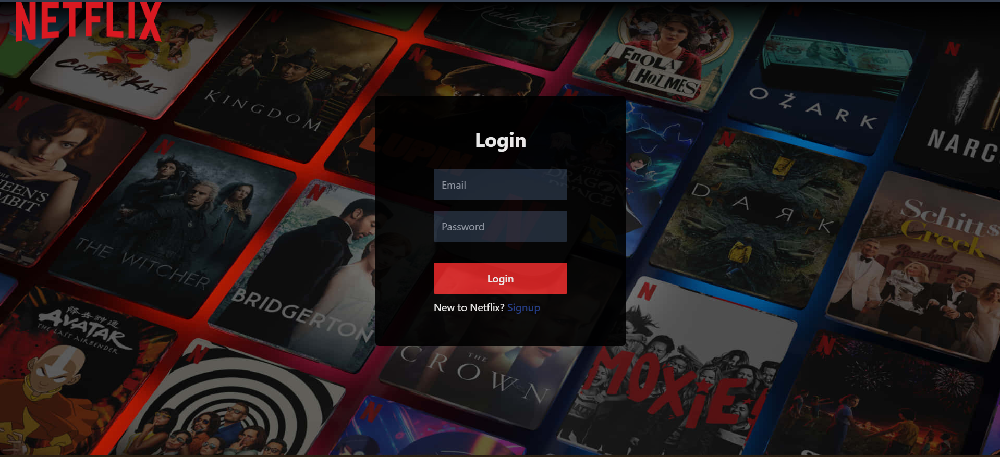
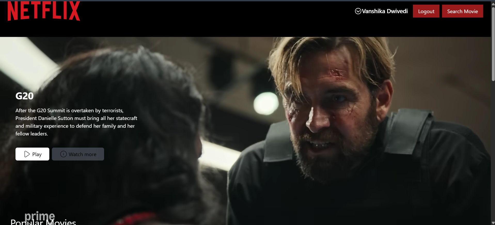
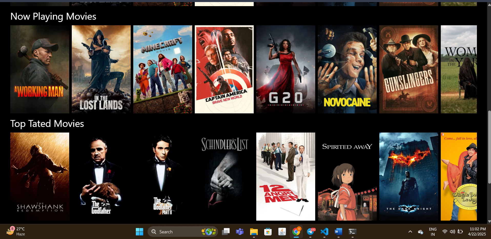
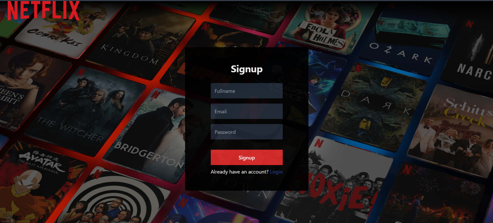

# 🎬 Netflix Clone 2.0

Welcome to **Netflix Clone 2.0**, a sleek and responsive full-stack clone of the Netflix streaming platform. Built using **React**, **Redux**, **Tailwind CSS**, and **TMDB API**, this project mimics the core UI and basic functionalities of Netflix, including login, registration, movie browsing, and search.

---

## 🚀 Features

- 🔐 User Authentication (Register & Login)
- 🎞 Browse movies by genre (Now Playing, Popular, Upcoming, Top Rated)
- 🔍 Movie search with real-time results
- 📽 Movie trailer preview using YouTube API
- 🍿 Fully responsive, modern UI (Tailwind CSS)
- 🧠 State management with Redux Toolkit
- 🌙 Dark themed UI like Netflix

---

## 📸 Screenshots

### 🔐 Login Page

### 🏠 Home/Browse Page

### 🎥 Movie Detail Popup

### 📝 Signup Page

---

